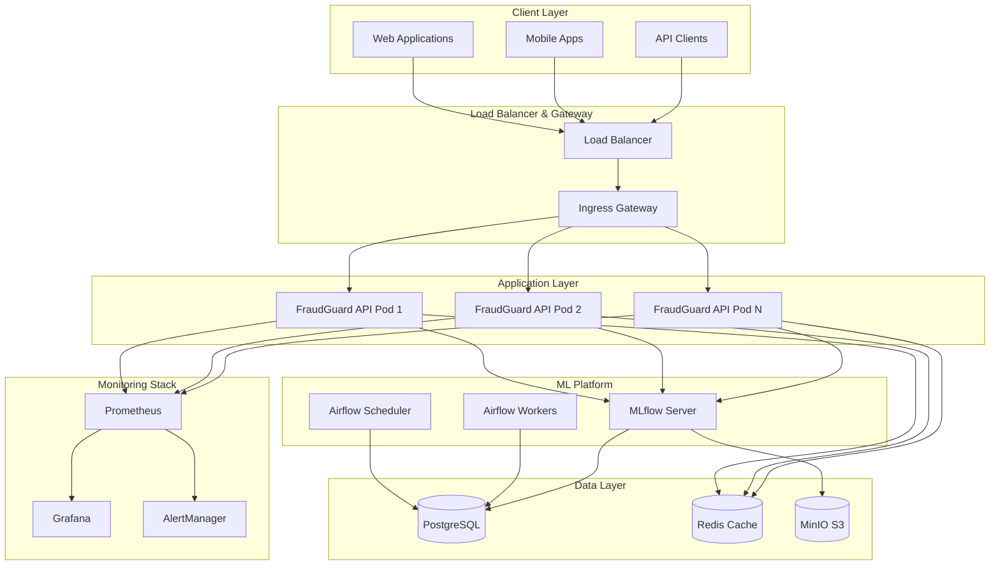

# 🏗️ FraudGuard - Architecture Technique

## Vue d'ensemble de l'architecture

FraudGuard implémente une architecture microservices cloud-native optimisée pour la détection de fraude en temps réel à l'échelle enterprise.

## 🌐 Architecture Système



## 🔄 Pipeline MLOps

### 1. Data Ingestion & Processing
- **Sources**: Transactions en temps réel, données historiques
- **Processing**: Apache Airflow orchestre le preprocessing
- **Storage**: PostgreSQL pour métadonnées, MinIO pour artifacts

### 2. Model Training & Validation
- **Experimentation**: MLflow tracking pour tous les runs
- **Models**: Random Forest + Isolation Forest
- **Validation**: Cross-validation + tests de performance
- **Registry**: MLflow Model Registry avec versioning

### 3. Model Deployment
- **Staging**: Déploiement automatique en environnement de test
- **Validation**: Tests A/B et validation des performances
- **Production**: Déploiement blue-green avec rollback automatique

### 4. Monitoring & Alerting
- **Performance**: Métriques business et techniques
- **Drift Detection**: Surveillance de la dérive des modèles
- **Alerting**: Notifications multi-canal (email, Slack, PagerDuty)

## 🏗️ Architecture Applicative

### FastAPI Application
```python
# Structure de l'application
src/api/fastapi_app.py
├── Routes (/api/v1/*)
├── Middleware (CORS, Auth, Logging)
├── Models (Pydantic validation)
├── Dependencies (DB, ML model)
└── Error Handlers
```

### Model Management
```python
# Gestionnaire de modèles
class ModelManager:
    ├── load_model()      # Chargement depuis MLflow
    ├── predict_single()  # Prédiction unique
    ├── predict_batch()   # Prédictions en lot
    └── health_check()    # Vérification de santé
```

## ☸️ Architecture Kubernetes

### Deployment Strategy
- **Replicas**: 3 minimum, jusqu'à 20 avec HPA
- **Rolling Updates**: Zero-downtime deployments
- **Health Checks**: Liveness + Readiness probes
- **Resource Limits**: CPU/Memory garantis et limités

### Auto-scaling Configuration
```yaml
# HPA basé sur multiple métriques
metrics:
  - CPU: 70%
  - Memory: 80%
  - Custom: http_requests_per_second > 1k
```

### Network Security
- **Network Policies**: Isolation inter-namespaces
- **TLS**: Chiffrement end-to-end
- **RBAC**: Permissions granulaires par service

## 🔍 Monitoring & Observabilité

### Métriques Business
- **Fraud Rate**: Taux de fraude détecté
- **Prediction Accuracy**: Précision du modèle
- **Transaction Volume**: Volume de transactions
- **Response Time**: Temps de réponse API

### Métriques Techniques
- **Request Rate**: Requêtes par seconde
- **Error Rate**: Taux d'erreur
- **Latency**: P50, P95, P99 latency
- **Resource Usage**: CPU, mémoire, I/O

### Alerting Rules
```yaml
# Exemples de règles d'alerte
- High Error Rate (>5% for 5min)
- High Latency (P95 >1s for 3min)
- Model Drift (prediction anomaly >50%)
- System Down (API unavailable for 1min)
```

## 🔐 Sécurité

### Application Security
- **Input Validation**: Pydantic schemas
- **Rate Limiting**: Per-IP et per-user limits
- **Authentication**: JWT tokens
- **Authorization**: Role-based access

### Infrastructure Security
- **Container Scanning**: Trivy dans CI/CD
- **Code Analysis**: Bandit, Semgrep
- **Secrets Management**: Kubernetes secrets + vault
- **Network Isolation**: Calico network policies

## 📊 Performance & Scalabilité

### Performance Targets
- **Latency**: P95 < 100ms
- **Throughput**: 10,000 req/s par pod
- **Availability**: 99.95% SLA
- **Resource Efficiency**: < 512MB RAM par pod

### Scaling Strategy
- **Horizontal**: Auto-scaling basé sur charge
- **Vertical**: Ajustement automatique des ressources
- **Geographic**: Multi-region deployment
- **Caching**: Redis pour modèles et résultats

## 🔄 CI/CD Pipeline

### Stages
1. **Validate**: Code quality, security scanning
2. **Test**: Unit, integration, performance tests
3. **Build**: Docker images + security scan
4. **Deploy**: Staging → validation → production
5. **Monitor**: Post-deployment checks

### Quality Gates
- **Code Coverage**: >90%
- **Security**: Zero critical vulnerabilities
- **Performance**: Latency regression <10%
- **Functional**: All E2E tests pass

## 📈 Monitoring Dashboard

### Business Metrics
- Fraud detection effectiveness
- Transaction volume trends
- Model confidence scores
- Cost per prediction

### Operational Metrics
- Service availability
- Response time distribution
- Error rate breakdown
- Resource utilization

### ML Metrics
- Model accuracy drift
- Feature importance changes
- Training pipeline health
- Data quality metrics

Cette architecture garantit une plateforme robuste, scalable et observable pour la détection de fraude en temps réel dans un environnement de production enterprise.